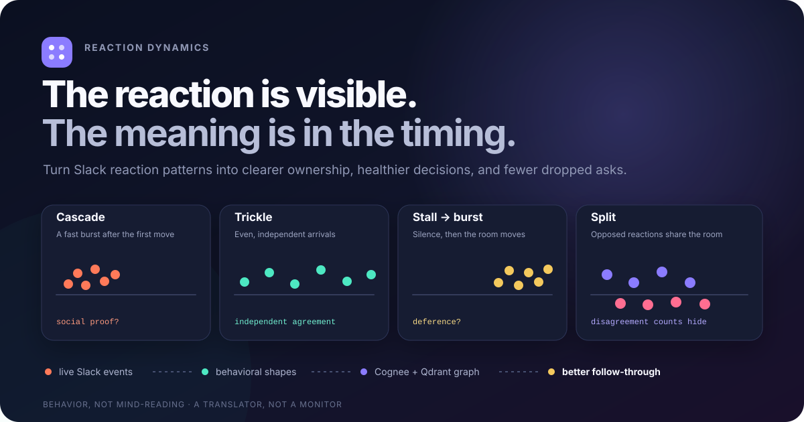
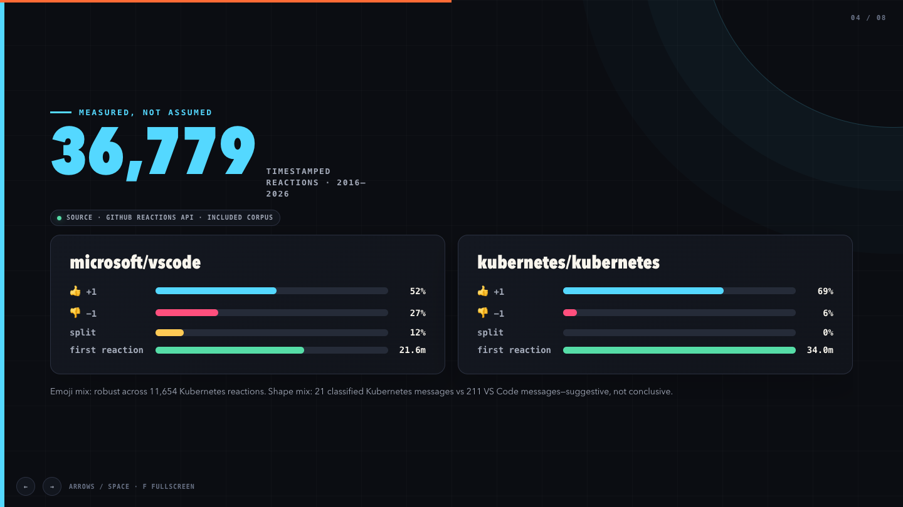
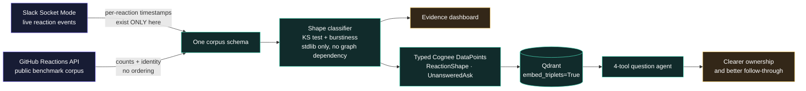
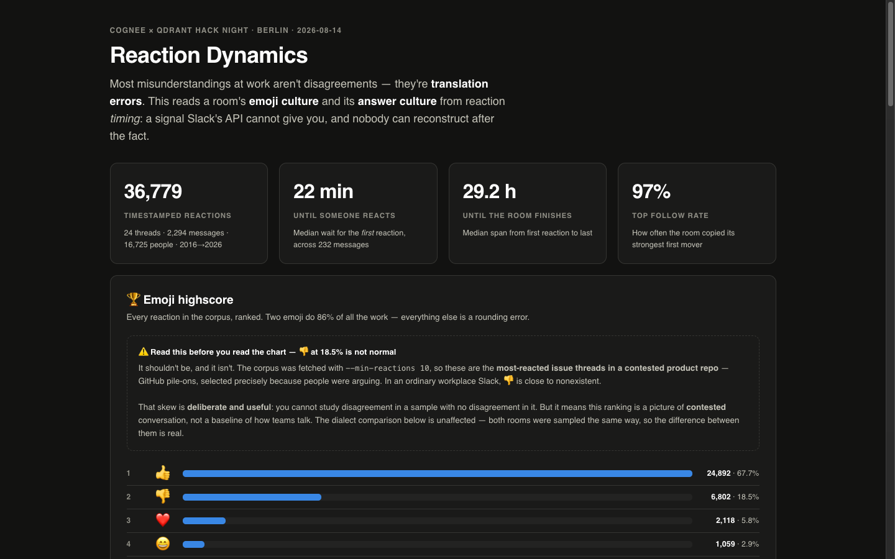
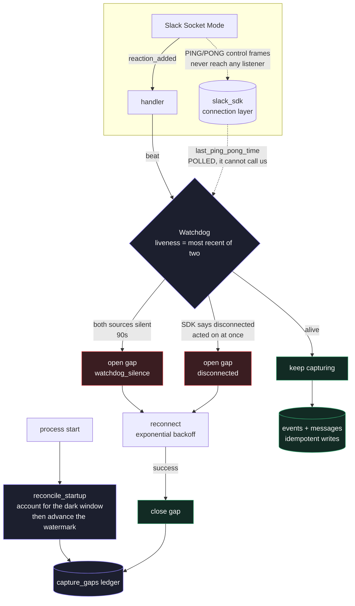

<p align="center">
  
</p>

<p align="center">
  <strong>An emoji translator for teams.</strong><br>
  Find acknowledged-but-unanswered work, hidden disagreement, and the reaction habits unique to each room.
</p>

<p align="center">
  <a href="dashboard.html"><strong>Evidence dashboard</strong></a> ·
  <a href="graph.html"><strong>Interactive knowledge graph</strong></a> ·
  <a href="docs/DEMO.md"><strong>90-second demo guide</strong></a> ·
  <a href="SUBMISSION.md"><strong>Hackathon submission</strong></a>
</p>
---

## What it does that nothing else can

**It reads the clock, not the count.**

Slack's Web API returns a reaction as `{name, users, count}`. No timestamps, no
ordering. That information exists for exactly as long as the live event is in
flight, and then it is gone — permanently, for everyone, including Slack's own
export. No vendor can add this feature retroactively to data they didn't capture.

So the thing this does that no analytics tool, export, or LLM-over-your-Slack can
do is simple: **it was there when it happened.**

| The question | Why nothing else answers it |
|---|---|
| *Who reacted first, and did the room follow?* | Ordering is never returned by the API at any resolution. It must be captured live or not at all. |
| *Is this agreement, or is this copying?* | Four 👍 in six seconds and four over an hour are the same count. Only arrival timing separates them — and only one of them is agreement. |
| *Was the room quiet, or were we not listening?* | Every other tool shows an outage as a flat line indistinguishable from calm. This one writes down its own blind spots. |
| *Does 👍 mean the same thing in both rooms?* | Requires per-room behavioral baselines, not a global sentiment model. |

The last row is the one people underestimate. A sentiment model reads the *emoji*.
This reads the *room* — and finds that 👎 is 27% of reactions in `microsoft/vscode`
and 6% in `kubernetes/kubernetes`. Same glyph. Different language.

<p align="center">
  
</p>

## Why this exists

A 👍 can mean “yes,” “seen,” “I’ll handle it,” or “I’m done arguing.” Slack shows
the final count, but the same count can describe completely different team
behavior.

Reaction Dynamics listens to **when** reactions arrive, classifies the response
shape, and connects that finding to the people, rooms, messages, and unanswered
asks in a Cognee knowledge graph backed by Qdrant.

The practical result is better follow-through—not more emoji:

| Team moment | What Reaction Dynamics surfaces | Better next action |
|---|---|---|
| A request has five 👍 and no reply | **Acknowledged, never answered** | Name an owner and ask for a substantive response |
| Everyone reacts seconds after one person | **Cascade** / possible social proof | Re-open the decision for independent input |
| The room stays quiet, then moves together | **Stall → burst** / possible deference | Invite lower-pressure or asynchronous feedback |
| Opposed reactions share the same message | **Split** / hidden disagreement | Resolve the disagreement before treating the count as consensus |
| Two channels use 👍 differently | A different **room dialect** | Make local reaction conventions explicit during onboarding |

> Reaction Dynamics describes observable group behavior. It does not infer
> emotion, intent, or employee performance.

## The missing signal

Slack’s Web API returns reactions as `{name, users, count}`—without timestamps or
ordering. Per-reaction timing exists only in the live `reaction_added` event.
If a listener was not running when the reaction happened, that signal cannot be
reconstructed from an export later.

That makes the live listener the first component to start and the one part of
the product a batch analytics tool cannot replace.

## How it works



The two edge labels carry the whole argument. Slack's Web API returns reactions
as `{name, users, count}` — no timestamps, no ordering — so per-reaction timing
exists *only* in the live `reaction_added` event. Miss the moment and it is gone
permanently. GitHub is the one public source with per-reaction identity **and**
timestamps, which is what makes it a usable benchmark for the same classifier.

Note where the classifier sits: it depends on neither Cognee nor Qdrant. A graph
outage removes the multi-hop questions, not the product.

Both sources normalize into the same dependency-free schema and classifier, so
“cascade” means the same thing in live Slack and in ten years of GitHub data.
The timescale remains visible because that difference is part of the finding.

The graph stores findings such as `ReactionShape` and `UnansweredAsk` as typed
nodes. With `embed_triplets=True`, Qdrant embeds relationships—not only the text
on either side—so questions can retrieve *who moved first in which room* or
*what was acknowledged without being answered*.

The question agent exposes four deterministic tools:

- `ghosted_asks` — requests with reactions and zero replies
- `bellwether` — who moves first and how often the room follows
- `room_dialect` — emoji and response-shape patterns by room
- `shapes_like` — messages matching cascade, trickle, stall-burst, or split

Keyword routing picks the tool, always — the LLM does not route. It only writes
the closing sentence from the tool's output, so every number comes from a tool.
Without an API key the answer is the same, minus the prose.

## Why this stack

Three deliberate choices, each doing something the alternatives can't.

### Slack Socket Mode — the only place the signal exists

Per-reaction timing is in the live `reaction_added` event and nowhere else. That
alone forces a live listener. Socket Mode makes that listener cheap:

- **No public host, no ngrok tunnel, no OAuth callback server, no frontend.** The
  connection is outbound, so it runs behind a laptop firewall or a corporate NAT.
- **One process.** `python seed/capture.py --channel C0…` and you are capturing.
- **Reproducible setup** from the committed `slack-app-manifest.json` — paste,
  install, invite the bot. About five minutes.
- **Strict arrival order** with the moment attached, which is exactly the input
  the classifier needs and exactly what the Web API refuses to return.

The trade is that Socket Mode gives you the data *only while you are listening* —
which is why half this repo is about proving you were.

### Cognee Cloud — findings as objects, not as text

The findings are written as **typed DataPoints** — `ReactionShape`,
`UnansweredAsk`, `Person`, `Room`, `Message` — so a finding is a first-class node
with real edges to the message it describes, the room it happened in, and the
person who moved first.

That matters because the alternative is dumping prose into a vector store and
hoping an LLM re-derives the entities at query time. Here the structure is
asserted at write time, so `who moved first in which room` is a graph traversal
rather than a guess. Cognee runs extraction → graph → vector store as one
pipeline; final state was **206 points across 13 collections**.

### Qdrant — embedding the relationship, not just the endpoints

The single best idea in the stack, and it is one flag:

```python
await add_data_points(points, embed_triplets=True)
```

This embeds the **edge** — `(Person) —[reacted-first-to]→ (Message)` — as its own
searchable vector, rather than only the two things on either side of it.

That is why *"where did the team disagree with itself"* retrieves anything at all.
**No message in the corpus contains the word "disagree."** The relationship does.
64 `Triplet_text` vectors carry the meaning that the node text cannot.

> **An honest note on speed.** At this corpus size Qdrant is not a performance
> win, and claiming otherwise would be borrowing someone else's benchmark.
> Measured, median of 3, warm: **287 ms** embedding, **318 ms** Qdrant round trip,
> 699 ms end to end. Neither leg is compute — ANN over 64 vectors is microseconds
> of work. Both are network. The lesson we took: locality beats configuration, and
> tuning HNSW at this scale would have optimised nothing. The reason to use Qdrant
> here is `embed_triplets`, not throughput. Ask again at a million vectors.

<p align="center">
  
</p>

<p align="center"><em>The evidence dashboard — every number traceable to a tool call.</em></p>

## Try the included corpus in 30 seconds

The classifier uses only the Python standard library. No Slack, Cognee, Qdrant,
API key, or network connection is required for the first run.

```bash
git clone https://github.com/kaiser-data/reaction-dynamics.git
cd reaction-dynamics
python3.12 seed/shapes.py --dialects --twins
```

This analyzes the included **36,779 timestamped reactions** from the GitHub
Reactions API and prints:

- the distribution and duration of response shapes;
- “twins” with the same reaction count but different arrival behavior;
- the different emoji dialects of `microsoft/vscode` and
  `kubernetes/kubernetes`.

To explore the visual artifacts locally:

```bash
python3.12 -m http.server 8000
# dashboard: http://localhost:8000/dashboard.html
# graph:     http://localhost:8000/graph.html
```

## Capture a live Slack room

Requirements: Python 3.12, `slack_sdk`, and a Slack app created from the included
manifest.

```bash
cp .env.example .env
python3.12 -m pip install slack_sdk

# Start this first and leave it running.
python3.12 seed/capture.py --channel YOUR_CHANNEL_ID

# Convert captured events and classify a short live response window.
python3.12 seed/live_to_corpus.py
python3.12 seed/shapes.py --corpus seed/corpus_slack.json --window 0.5
```

`capture.py` writes to a SQLite store (`seed/capture.db`, gitignored — it holds
your workspace's messages). Writes are idempotent, keyed on a hash of the
event's identifying fields, so a Socket Mode replay or a reconnect cannot
double-count a reaction.

`seed/listen_slack.py` is the original append-only JSONL listener and still
works. Prefer `capture.py`: the JSONL listener cannot tell you whether it was
running.

### Recording what was *not* captured

Per-reaction timing exists only in the live Slack event. If nothing is listening
at the moment someone reacts, that timing is gone — no export, no API call, no
backfill reconstructs it. So the failure that matters is not a crash, it is a
listener that is up but not receiving, because the resulting hole in the data
looks exactly like a quiet afternoon.

`capture.py` therefore treats **socket silence as failure**. Slack keeps the
connection alive with WebSocket ping/pong frames, so a healthy idle socket is
still demonstrably alive even when nobody is reacting. If the connection stops
showing signs of life for `--silence-limit` seconds (default 90), the daemon
opens a row in the `capture_gaps` ledger, reconnects with exponential backoff,
and closes the row when it recovers.

Silence is a timeout, though, and cannot report anything until the full limit has
elapsed. When the SDK already knows the socket dropped, the daemon acts on that
immediately rather than spending 90 seconds agreeing with it — a shorter gap, and
a shorter real outage. It is deliberately hard to fire: a reading of "connected"
is required to be an explicit `False`, since the SDK also reports that mid-
handshake, and an unknown or unavailable reading falls back to the timeout rather
than reconnecting in a loop.



The dotted edges are the whole lesson. **Socket Mode keepalives are WebSocket
control frames** — the SDK handles them at the protocol layer and they reach *no*
application listener. The first version of this watchdog assumed otherwise, and so
declared a perfectly healthy idle socket dead every 90 seconds, inventing a gap
each time. Liveness has to be polled from `last_ping_pong_time`; it cannot be
pushed to you.

Every window the tool cannot positively account for becomes a record:

| reason | meaning |
|---|---|
| `cold_start` | the span between the last run's last known activity and this start |
| `watchdog_silence` | the socket went quiet while the process was up |
| `disconnected` | the SDK reported the socket down, caught without waiting out the silence limit |
| `crash` | a gap the previous run never closed, detected at startup |
| `clean_shutdown` | a planned stop, closed on SIGINT/SIGTERM |

Two rules the ledger follows, both of which are the point of it:

- **A first-ever run records no gap.** Having no history is not the same as
  having a hole in it, and inventing one would be the error the ledger exists to
  prevent.
- **Open gaps are excluded from total dark time.** An unfinished gap has no
  measurable length yet, and guessing would fabricate the number.
- **No dark second is counted twice.** Restart windows tile rather than overlap,
  so a daemon that crash-loops for five minutes reports five minutes down — not
  fifty. Over-reporting downtime discredits the ledger exactly as fast as
  under-reporting it.

The dashboard reads the same store and says so out loud: a red banner when its
own data has gone stale, and a warning line when a capture gap is open.

### Surviving crashes and reboots

The watchdog handles a process that is alive and not working. It cannot help with
a process that is dead, a machine that rebooted, or an OOM kill. `deploy/` has a
launchd agent and a systemd unit for that layer, with install steps and the two
settings whose defaults are wrong for this job — see [`deploy/README.md`](deploy/README.md).

Restarting never erases the outage: the window the daemon was down is recorded as
a `cold_start` or `crash` gap on the way back up.

Create the app at [api.slack.com/apps](https://api.slack.com/apps): choose
**From an app manifest**, paste `slack-app-manifest.json`, install it, create an
App-Level Token with `connections:write`, and invite `@cognee-graph` to the
consented test channel.

Socket Mode keeps setup lightweight: no public host, ngrok tunnel, OAuth server,
or frontend is required.

## Example questions

```bash
python3.12 seed/ask.py --raw "which asks did nobody answer?"
python3.12 seed/ask.py --raw "where did the room disagree?"
python3.12 seed/ask.py --raw "who tends to move first?"
python3.12 seed/ask.py --raw "how does each room use emoji?"
```

Remove `--raw` after configuring `LLM_MODEL` and `LLM_API_KEY` in `.env` to add
the short prose layer.

## What the benchmark found

The included corpus contains 24 reaction-heavy GitHub threads, 2,294 messages,
16,725 distinct reactors, and 36,779 timestamped reactions from 2016–2026.

| | `microsoft/vscode` | `kubernetes/kubernetes` |
|---|---:|---:|
| 👍 `+1` | 52% | 69% |
| 👎 `-1` | **27%** | **6%** |
| `split` shapes | **12%** | **0%** |
| `trickle` shapes | 65% | 90% |

The emoji-mix difference is robust across 11,654 Kubernetes reactions. The
shape comparison is smaller—21 classified Kubernetes messages versus 211 for
VS Code—so it is suggestive rather than conclusive.

The current 48-hour analysis gives a median GitHub cascade span of **32.7 hours**.
Seconds-scale cascades are a live
room phenomenon, reinforcing why Slack reaction events must be captured as they
happen.

## Build snapshot

| Component | Repository state |
|---|---|
| Included GitHub corpus | 36,779 reactions; reproducible from the API |
| Shape classifier and dialect comparison | Working; 232 messages classify in the current 48-hour run |
| Slack Socket Mode listener | Implemented with immediate JSONL flushing |
| Cognee → Qdrant ingest | Typed findings with relationship embeddings |
| Evidence dashboard | Standalone HTML artifact included |
| Interactive graph | Standalone Cognee graph export included |
| Four-tool question agent | Working with LLM prose or offline keyword routing |

## Classification, briefly

- At least four timed reactions are required.
- Reactions within a configurable response window are normalized between the
  first and last arrival; later reactions are reported separately as a tail.
- A one-sample Kolmogorov–Smirnov statistic tests whether arrival positions are
  consistent with a uniform trickle (`1.36/√n` at α = 0.05).
- Goh–Barabási burstiness summarizes the spacing between reactions.
- A `split` is detected only for explicit opposed reaction pairs when the
  minority side reaches 20%; it is not a general sentiment classifier.

## Project map

```text
dashboard.html             standalone evidence dashboard
graph.html                 interactive Cognee knowledge-graph export
seed/schema.py             shared GitHub/Slack corpus model
seed/fetch_github.py       cached, resumable GitHub corpus builder
seed/capture.py            supervised capture daemon; records its own downtime
seed/store.py              SQLite store, idempotent writes, capture gap ledger
seed/listen_slack.py       original JSONL listener (kept working; no gap ledger)
seed/live_to_corpus.py     live JSONL → shared corpus schema
seed/shapes.py             KS-tested response-shape classifier
seed/ingest_cognee.py      typed DataPoints → Cognee → Qdrant
seed/ask.py                four-tool query agent with offline routing
deploy/                    launchd and systemd units for crash-restart
slack-app-manifest.json    reproducible Slack app configuration
tests/                     63 tests; none contact Slack, Cognee, or Qdrant
docs/assets/LOGO.md        logo files, usage rules, image-generator prompt
docs/LEARNINGS.md          field notes: cognee + Qdrant sharp edges
docs/HANDOFF-durable-capture.md  the two bugs, and why tests missed both
docs/HANDOFF.md            engineering decisions and verified run state
docs/DEMO.md               concise presentation and demo flow
```

## Tests

```bash
pip install pytest
python -m pytest
```

63 tests, ~0.1s. **No test contacts Slack, Cognee, or Qdrant** (two SDK contract
checks skip themselves when `slack_sdk` is absent). A green run
proves the store, the gap ledger, the classifier and the watchdog logic behave;
it does not prove the live socket path works. That distinction is not pedantry —
the watchdog shipped with a bug that every test passed over, because the tests
drove its timer directly and nothing exercised what feeds it. Only a real
capture run found it.

## What you need before the conclusions are trustworthy

This is the part most emoji-analytics writeups skip, so it gets its own section.
Reaction timing is a real signal, but it is **easy to over-read**, and the honest
answer to "what does this 👍 mean" is often *not enough data yet*.

**Four timed reactions per message, minimum.** Below that the classifier returns
`forming` and refuses to name a shape. It does not guess. During the live hack-night
capture, no single message reached four timed reactions — so the live demo could
show real ordering and *no* classification, and said so on the slide.

**Both rooms sampled the same way.** A dialect comparison is only meaningful if the
sampling frame matches. Ours does — same API, same `--min-reactions 10` threshold,
same window — which is why the vscode/kubernetes emoji comparison holds up at
11,654 Kubernetes reactions. The *shape* comparison is thinner: 21 classified
Kubernetes messages against 211 for VS Code. Suggestive, not established.

**A representative frame, and the honesty to say when it isn't.** The benchmark
corpus is deliberately skewed: `--min-reactions 10` selects the most-argued-about
threads on GitHub. That is the right choice for studying disagreement — you cannot
find disagreement in a sample with none — but it means 👎 at 18.5% describes
*contested open-source threads*, not workplaces.

**Continuous capture, or a record of the holes.** A gap in coverage looks exactly
like a quiet room, and a timing analysis run across an unrecorded outage will
produce confident nonsense. Hence the gap ledger; hence most of this repo.

**Per-room baselines, not a global sentiment model.** 👍 is affirmation in one
room, dismissal in another, and rude in several countries. Skin-tone modifiers,
regional conventions, and in-jokes all shift meaning. A model trained on "emoji
sentiment" in general will be confidently wrong about your specific room. What
transfers is *arrival behavior*; what does not transfer is *glyph meaning*.

**Enough history for a baseline.** "The room followed the first mover 97% of the
time" needs enough occasions to be a rate rather than an anecdote. Ours rests on
7 occasions for the top mover — reportable, but stated with the denominator every
time.

> The short version: this tool measures **when**, reliably. Turning *when* into
> *why* is a human judgment about a specific room, and the further you get from the
> timing, the more you should be asking for data rather than asserting meaning.

## Responsible use

This is a **triage signal, not a decision system**.

- Never rank people or use reaction speed as a performance target.
- Treat a reaction pattern as a prompt to investigate, not proof of intent.
- Capture only consented channels and keep raw Slack events local.
- Frame concentrated response load as organizational fragility, not praise or
  blame for the person carrying it.

The goal is to prevent translation errors and improve the quality of work—not
to manufacture faster, lower-quality replies.

---

## Thanks

Built at the **Cognee × Qdrant Hack Night**, Berlin, 2026-08-14 — and it took
first place.

Genuine thanks to the organizers and to both teams for running it: for putting
`embed_triplets` in reach in a single evening, for answering adapter questions in
real time at 1 a.m., and for building the kind of room where four people react to
a message within six seconds and someone decides to go measure it.

The rough edges we hit are written up in [`docs/LEARNINGS.md`](docs/LEARNINGS.md) —
not as complaints, but because "the distance metric inverts and the field is still
called `score`" is the sort of thing that costs the next person an hour.

### One last thing

The corpus was fetched with `--min-reactions 10`, which selects the most-argued-about
threads on GitHub. That is why 👎 sits at 18.5% of all reactions. If your workplace
Slack is running an 18.5% thumbs-down rate, this tool is not your most urgent
problem, but do book the retro.

And in the interest of the honesty this whole project is about: the watchdog's first
act, on a perfectly healthy connection, was to declare it dead every ninety seconds
and file paperwork about it. Then the crash-restart supervision taught it to bill
ninety seconds of downtime as a hundred and eighty. The gap ledger caught its own
author lying twice, in opposite directions, and 63 green tests noticed neither.
Both incidents are documented in
[`docs/HANDOFF-durable-capture.md`](docs/HANDOFF-durable-capture.md), because a
tool that admits when it wasn't listening should probably also admit when it was
making things up.

---

Built by Martin Kaiser.
