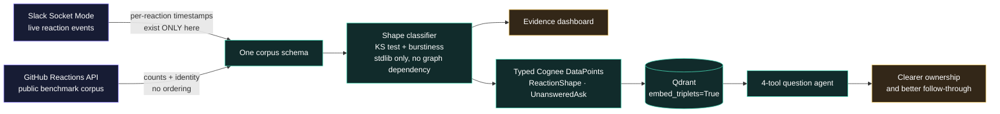

<p align="center">
  
</p>

<p align="center">
  <strong>An emoji translator for teams.</strong><br>
  Find acknowledged-but-unanswered work, hidden disagreement, and the reaction habits unique to each room.
</p>

<p align="center">
  <a href="dashboard.html"><strong>Evidence dashboard</strong></a> ·
  <a href="graph.html"><strong>Interactive knowledge graph</strong></a> ·
  <a href="docs/DEMO.md"><strong>90-second demo guide</strong></a> ·
  <a href="SUBMISSION.md"><strong>Hackathon submission</strong></a>
</p>

---

## Why this exists

A 👍 can mean “yes,” “seen,” “I’ll handle it,” or “I’m done arguing.” Slack shows
the final count, but the same count can describe completely different team
behavior.

Reaction Dynamics listens to **when** reactions arrive, classifies the response
shape, and connects that finding to the people, rooms, messages, and unanswered
asks in a Cognee knowledge graph backed by Qdrant.

The practical result is better follow-through—not more emoji:

| Team moment | What Reaction Dynamics surfaces | Better next action |
|---|---|---|
| A request has five 👍 and no reply | **Acknowledged, never answered** | Name an owner and ask for a substantive response |
| Everyone reacts seconds after one person | **Cascade** / possible social proof | Re-open the decision for independent input |
| The room stays quiet, then moves together | **Stall → burst** / possible deference | Invite lower-pressure or asynchronous feedback |
| Opposed reactions share the same message | **Split** / hidden disagreement | Resolve the disagreement before treating the count as consensus |
| Two channels use 👍 differently | A different **room dialect** | Make local reaction conventions explicit during onboarding |

> Reaction Dynamics describes observable group behavior. It does not infer
> emotion, intent, or employee performance.

## The missing signal

Slack’s Web API returns reactions as `{name, users, count}`—without timestamps or
ordering. Per-reaction timing exists only in the live `reaction_added` event.
If a listener was not running when the reaction happened, that signal cannot be
reconstructed from an export later.

That makes the live listener the first component to start and the one part of
the product a batch analytics tool cannot replace.

## How it works



The two edge labels carry the whole argument. Slack's Web API returns reactions
as `{name, users, count}` — no timestamps, no ordering — so per-reaction timing
exists *only* in the live `reaction_added` event. Miss the moment and it is gone
permanently. GitHub is the one public source with per-reaction identity **and**
timestamps, which is what makes it a usable benchmark for the same classifier.

Note where the classifier sits: it depends on neither Cognee nor Qdrant. A graph
outage removes the multi-hop questions, not the product.

Both sources normalize into the same dependency-free schema and classifier, so
“cascade” means the same thing in live Slack and in ten years of GitHub data.
The timescale remains visible because that difference is part of the finding.

The graph stores findings such as `ReactionShape` and `UnansweredAsk` as typed
nodes. With `embed_triplets=True`, Qdrant embeds relationships—not only the text
on either side—so questions can retrieve *who moved first in which room* or
*what was acknowledged without being answered*.

The question agent exposes four deterministic tools:

- `ghosted_asks` — requests with reactions and zero replies
- `bellwether` — who moves first and how often the room follows
- `room_dialect` — emoji and response-shape patterns by room
- `shapes_like` — messages matching cascade, trickle, stall-burst, or split

The LLM routes and summarizes; every number comes from tool output. Keyword
routing still works when the prose layer is unavailable.

## Try the included corpus in 30 seconds

The classifier uses only the Python standard library. No Slack, Cognee, Qdrant,
API key, or network connection is required for the first run.

```bash
git clone https://github.com/kaiser-data/reaction-dynamics.git
cd reaction-dynamics
python3.12 seed/shapes.py --dialects --twins
```

This analyzes the included **36,779 timestamped reactions** from the GitHub
Reactions API and prints:

- the distribution and duration of response shapes;
- “twins” with the same reaction count but different arrival behavior;
- the different emoji dialects of `microsoft/vscode` and
  `kubernetes/kubernetes`.

To explore the visual artifacts locally:

```bash
python3.12 -m http.server 8000
# dashboard: http://localhost:8000/dashboard.html
# graph:     http://localhost:8000/graph.html
```

## Capture a live Slack room

Requirements: Python 3.12, `slack_sdk`, and a Slack app created from the included
manifest.

```bash
cp .env.example .env
python3.12 -m pip install slack_sdk

# Start this first and leave it running.
python3.12 seed/listen_slack.py --channel YOUR_CHANNEL_ID

# Convert captured events and classify a short live response window.
python3.12 seed/live_to_corpus.py
python3.12 seed/shapes.py --corpus seed/corpus_slack.json --window 0.5
```

Create the app at [api.slack.com/apps](https://api.slack.com/apps): choose
**From an app manifest**, paste `slack-app-manifest.json`, install it, create an
App-Level Token with `connections:write`, and invite `@cognee-graph` to the
consented test channel.

Socket Mode keeps setup lightweight: no public host, ngrok tunnel, OAuth server,
or frontend is required.

## Example questions

```bash
python3.12 seed/ask.py --raw "which asks did nobody answer?"
python3.12 seed/ask.py --raw "where did the room disagree?"
python3.12 seed/ask.py --raw "who tends to move first?"
python3.12 seed/ask.py --raw "how does each room use emoji?"
```

Remove `--raw` after configuring `LLM_MODEL` and `LLM_API_KEY` in `.env` to add
the short prose layer.

## What the benchmark found

The included corpus contains 24 reaction-heavy GitHub threads, 2,294 messages,
16,725 distinct reactors, and 36,779 timestamped reactions from 2016–2026.

| | `microsoft/vscode` | `kubernetes/kubernetes` |
|---|---:|---:|
| 👍 `+1` | 52% | 69% |
| 👎 `-1` | **27%** | **6%** |
| `split` shapes | **12%** | **0%** |
| `trickle` shapes | 65% | 90% |

The emoji-mix difference is robust across 11,654 Kubernetes reactions. The
shape comparison is smaller—21 classified Kubernetes messages versus 211 for
VS Code—so it is suggestive rather than conclusive.

The current 48-hour analysis gives a median GitHub cascade span of **32.7 hours**.
Seconds-scale cascades are a live
room phenomenon, reinforcing why Slack reaction events must be captured as they
happen.

## Build snapshot

| Component | Repository state |
|---|---|
| Included GitHub corpus | 36,779 reactions; reproducible from the API |
| Shape classifier and dialect comparison | Working; 232 messages classify in the current 48-hour run |
| Slack Socket Mode listener | Implemented with immediate JSONL flushing |
| Cognee → Qdrant ingest | Typed findings with relationship embeddings |
| Evidence dashboard | Standalone HTML artifact included |
| Interactive graph | Standalone Cognee graph export included |
| Four-tool question agent | Working with LLM prose or offline keyword routing |

## Classification, briefly

- At least four timed reactions are required.
- Reactions within a configurable response window are normalized between the
  first and last arrival; later reactions are reported separately as a tail.
- A one-sample Kolmogorov–Smirnov statistic tests whether arrival positions are
  consistent with a uniform trickle (`1.36/√n` at α = 0.05).
- Goh–Barabási burstiness summarizes the spacing between reactions.
- A `split` is detected only for explicit opposed reaction pairs when the
  minority side reaches 20%; it is not a general sentiment classifier.

## Project map

```text
dashboard.html             standalone evidence dashboard
graph.html                 interactive Cognee knowledge-graph export
seed/schema.py             shared GitHub/Slack corpus model
seed/fetch_github.py       cached, resumable GitHub corpus builder
seed/listen_slack.py       live Socket Mode event capture
seed/live_to_corpus.py     live JSONL → shared corpus schema
seed/shapes.py             KS-tested response-shape classifier
seed/ingest_cognee.py      typed DataPoints → Cognee → Qdrant
seed/ask.py                four-tool query agent with offline routing
slack-app-manifest.json    reproducible Slack app configuration
docs/HANDOFF.md            engineering decisions and verified run state
docs/DEMO.md               concise presentation and demo flow
```

## Responsible use

This is a **triage signal, not a decision system**.

- Never rank people or use reaction speed as a performance target.
- Treat a reaction pattern as a prompt to investigate, not proof of intent.
- Capture only consented channels and keep raw Slack events local.
- Frame concentrated response load as organizational fragility, not praise or
  blame for the person carrying it.

The goal is to prevent translation errors and improve the quality of work—not
to manufacture faster, lower-quality replies.

---

Built by Martin Kaiser for the **Cognee × Qdrant Hack Night**, Berlin, 2026-08-14.
